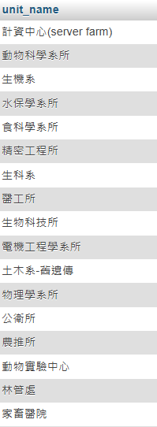
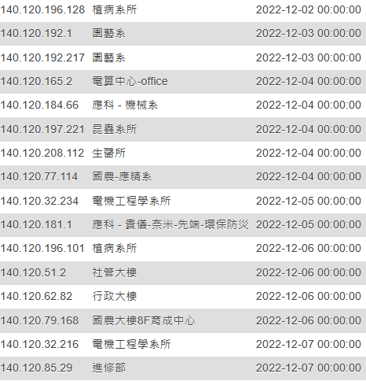

# NCHU_Network-Traffic-Analysis

用來進行中興大學的網路流量分析與IP對應分析，純粹為了好玩。   
---  
使用方法:
```
python3 -m pip install -r .\requirements.txt
python3 .\main
```

1. 使用選項四，輸入資料庫連線資料
2. 輸入開始擷取日期
3. 輸入結束擷取日期
4. 進行自動資料庫導入

或是可以將 `NCHU_Network-Traffic-Analysis\data\nchutrafficdb.sql` 導入資料庫進行直接查詢。

---
## 預覽  

```
SELECT DISTINCT `unit_name` FROM `ip_unit`;
```


```
SELECT * FROM `ip_unit` ORDER BY `last_updated` ASC;
```


---  
## 專案規劃
###    **目前進度：已完成**

1. **透過 top100.nchu.edu.tw 獲得流量**  
   從 top100.nchu.edu.tw 網站獲取中興大學網路流量的數據。

2. **透過爬蟲解析流量**  
   使用 Python 和 BeautifulSoup 等工具編寫爬蟲，解析獲取的流量數據。  


3. **將流量規劃並導入資料庫**  
   設計數據的規劃與清理流程，並將處理後的數據導入資料庫，以便進一步分析。


---
### **目前進度：尚未開始**
4. **設計資料庫功能**  
   設計並實現資料庫的查詢和分析功能，提供便捷的介面以進行流量數據的檢索和統計分析。  
5. **資料可視化與報告生成**  
   設計資料可視化功能，生成圖表和報告，以便更直觀地呈現網路流量分析結果。  


6. **其他功能（待定）**  
   視專案進展情況和需求，可能添加更多功能。
